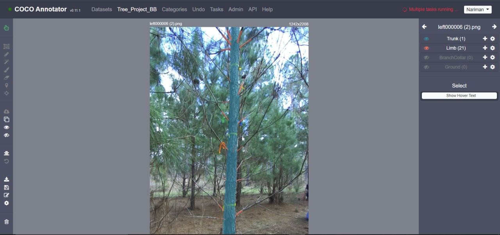

# TreePheno Dataset for Mask R-CNN

## Overview

This repository contains the dataset and annotation files used in the study: *Phenotyping of architecture traits of loblolly pine trees using stereo machine vision and deep learning: Stem diameter, branch angle, and branch diameter*. The dataset includes annotated images of pine trees focusing on the trunk and branches. This dataset is intended to support research in tree phenotyping and can be used to train models for instance segmentation using Mask R-CNN.

## Dataset Description

The images were annotated to identify and segment the trunk and branches of the trees. The images are annotated using [COCO annotator](https://github.com/jsbroks/coco-annotator). 

    

### Data Files

- **images/**: Contains stereo image pairs of the pine trees.
- **annotations/**: JSON files in COCO format containing the annotations for stem and branches.
- **metadata/**: Information about the image acquisition setup and ground-truth measurements.

### Annotation Details

- **Stems**: Annotated to capture the entire visible stem of the tree.
- **Branches**: Annotated based on proximity to the stem and approximate length equal to the stem diameter at the base of the branch.

### Data Collection

- Images were captured at various angles (0°, 15°, 30°, 45°) around each tree.
- The camera was positioned at 1.5 meters from the tree at a height of 1.3 meters.
- Ground-truth measurements were taken using a diameter tape for stem diameter and a digital caliper for branch diameter.

### Data Collection
- **Camera**: RGB stereo camera (ZED2, STEREOLABS, France)
- **Resolution**: 2208 × 1242 pixels

## Citation
Researchers can use this dataset to develop and evaluate their tree phenotyping analysis. When using this dataset, please cite the following paper:

@article{niknejad2023phenotyping,
  title={Phenotyping of architecture traits of loblolly pine trees using stereo machine vision and deep learning: Stem diameter, branch angle, and branch diameter},
  author={Niknejad, Nariman and Bidese-Puhl, Rafael and Bao, Yin and Payn, Kitt G and Zheng, Jingyi},
  journal={Computers and Electronics in Agriculture},
  volume={211},
  pages={107999},
  year={2023},
  publisher={Elsevier}
}

